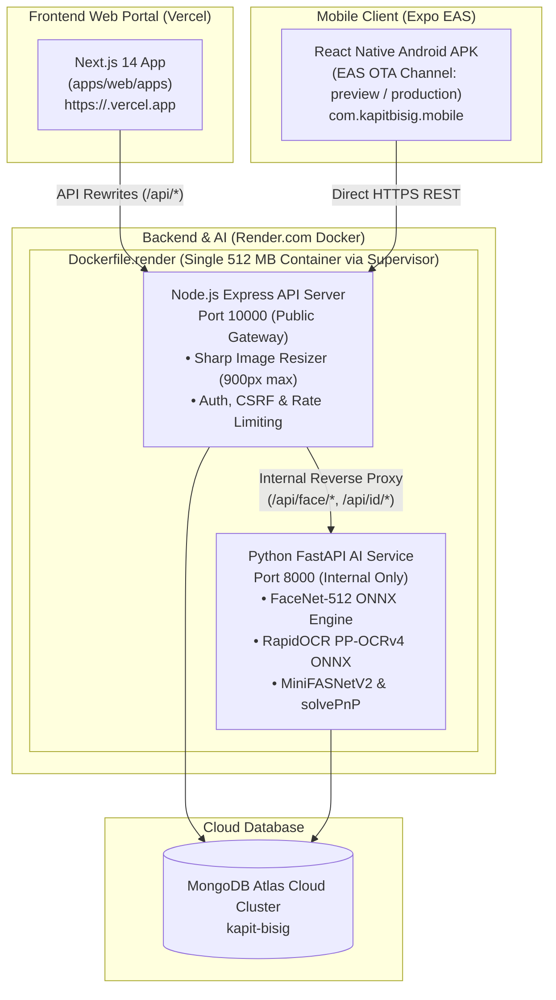

# Kapit-Bisig

> **Municipal Disaster Relief & Social Welfare Assistance Management System with Biometric Fraud Prevention**

[](https://vercel.com)
[](https://render.com)
[](https://expo.dev)
[](https://mongodb.com)

**Kapit-Bisig** ("Holding Hands" / "Bayanihan Solidarity") is an end-to-end municipal platform designed for Philippine Local Government Units (LGUs), emergency response teams, and social welfare departments. It modernizes the distribution of calamity aid, food packs, and targeted social welfare subsidies while eliminating double-claiming fraud through deep-learning biometrics and automated document screening.

---

## Key Capabilities & Core Upgrades

### 1. Biometric Deduplication (FaceNet-512 ONNX)
- Replaces legacy 128-d models and heavy TensorFlow frameworks with **FaceNet-512 ONNX** running on CPU-optimized ONNX Runtime.
- Transforms face images into **512-dimensional $L_2$-normalized vectors** on a unit hypersphere ($\|\mathbf{v}\|_2 = 1$).
- Calculates **Cosine Similarity** ($\mathbf{u} \cdot \mathbf{v}$) across the municipal database. Registrations with similarity $\ge 0.85$ (`DUPLICATE_THRESHOLD`) are automatically blocked to prevent multiple claims across barangays.
- Supports applicant self-exclusion (`exclude_resident_id`) during profile re-scans.

### 2. Deep-Learning Government ID Verification (RapidOCR PP-OCRv4)
- **RapidOCR ONNX Engine**: Replaced client-side Tesseract with lightweight PaddleOCR PP-OCRv4 detection and recognition models.
- **Cardholder Portrait Detection**: Uses OpenCV Haar Cascades with CLAHE lighting normalization to verify that an authentic portrait photo exists on the card (filtering out non-ID documents like utility bills or receipts).
- **ISO/IEC 7810 Card Geometry**: Auto-crops card boundaries (`cv2.approxPolyDP`) and validates standard ID-1 aspect ratios (~1.58:1).
- **Statutory Authority Matching**: Identifies official Philippine government issuing agencies (PhilSys National ID, LTO Driver's License, UMID, Voter's, Postal, PhilHealth, TIN, Barangay, Senior Citizen, Passport) and cross-verifies applicant details.

### 3. Active 3D Liveness Detection & Anti-Spoofing
- **Passive Anti-Spoofing**: Employs **MiniFASNetV2 ONNX** to detect high-frequency surface texture artifacts, screen Moire patterns, and printed photos.
- **Active 3D Parallax Challenge**: Prompts a 2-step challenge (frontal baseline + horizontal head turn). Tracks 3D head pose and perspective foreshortening using `cv2.solvePnP` to reject 2D planar replays.

### 4. General vs. Targeted Aid Distributions
- **General Relief Distributions**: Dispatches universal relief assistance to all active, verified households in designated barangays during municipal emergencies.
- **Targeted Assistance**: Delivers sector-specific assistance (e.g., 4Ps, PWD, Senior Citizens, Solo Parents) backed by pre-assessment intake workflows and criteria validation.
- **Cryptographic Proof QR Gating**: Dynamically generates encrypted household QR tokens per distribution cycle to eliminate counterfeit vouchers.
- **Auto-Completion & Archival**: Automatically marks distribution cycles as completed upon reaching 100% claim disbursement.

### 5. Staff Offline Scanner Mode
- Equips relief workers in disaster evacuation centers with **offline distribution scanning** when cellular data and internet are severed.
- Caches encrypted beneficiary lists locally and cryptographically validates QR tokens offline.
- Queues completed claims on physical Android devices and automatically synchronizes with MongoDB Atlas once connectivity is restored.

### 6. Enterprise Security & Privacy Compliance
- **Philippine Data Privacy Act (R.A. 10173)**: Raw face photos are processed in transient memory and discarded. Only non-reversible 512-float mathematical embeddings are persisted.
- **Unified Role-Based Auth**: Superadmin, LGU Staff, Field Volunteers, and Citizens.
- **Defense-in-Depth**: Email & SMS OTP verification, double-submit cookie CSRF protection, NoSQL injection sanitization, and strict production rate limiting.

---

## Production Deployment Topology

The entire system is deployed on production infrastructure:



| Component | Platform | Configuration / Notes |
| :--- | :--- | :--- |
| **Frontend Web** | **Vercel** | Next.js 14 with server-side API proxy rewrites to Render (zero third-party cookie issues). |
| **Backend & AI** | **Render.com** | Single unified Docker container (`Dockerfile.render`) running Express and FastAPI under Supervisor (~330 MB idle / ~380 MB peak). |
| **Mobile App** | **Expo EAS** | Standalone Android APK (`preview` profile) and Over-The-Air (OTA) runtime updates via `expo-updates`. |
| **Database** | **MongoDB Atlas** | TLS 1.3 enforced cloud cluster storing residents, households, distributions, and audit logs. |

---

## Monorepo Structure

```text
kapit-bisig/
├── apps/
│   └── web/
│       └── apps/                      # Next.js 14 Web Portal & Express Node.js Server
│           ├── server/                # Express API server entry, routes & middleware
│           │   ├── routes/            # Unified auth, distributions, claims, AI proxy
│           │   └── services/          # Superadmin seed, OCR fallback, audit services
│           ├── src/                   # Next.js React frontend (Admin, Staff, Settings)
│           ├── next.config.js         # API proxy rewrites & production build config
│           └── Dockerfile.render      # Multi-stage production container build
├── backend/                           # Python FastAPI AI Microservice
│   ├── main.py                        # FastAPI endpoints (/api/face/*, /api/id/*)
│   ├── models/                        # Pre-trained ONNX models (facenet, PP-OCR, MiniFAS)
│   ├── services/
│   │   ├── face_embedding_service.py  # FaceNet-512 ONNX embedding pipeline
│   │   ├── active_liveness_service.py # solvePnP 3D pose tracking & parallax
│   │   ├── id_verification_service.py # RapidOCR PP-OCRv4 & portrait detector
│   │   └── liveness_service.py        # MiniFASNetV2 passive anti-spoofing
│   └── requirements-deploy.txt        # Production Python dependencies
├── mobile/                            # Expo / React Native Mobile Application
│   ├── components/                    # FaceScannerV2, IDScanner, offline sync UI
│   ├── services/                      # API clients, offline SQLite sync, biometric services
│   ├── app.json                       # Expo configuration & EAS OTA update settings
│   └── eas.json                       # EAS build profiles (preview APK, production AAB)
├── docs/                              # Comprehensive Technical Documentation
├── Dockerfile.render                  # Unified production container specification
├── supervisord.conf                   # Process manager (Node Express + Python FastAPI)
├── start.sh                           # Container bootloader script
└── package.json                       # Monorepo root script orchestration
```

---

## Documentation Index

| Guide | File Path | Focus |
| :--- | :--- | :--- |
| **Master System Documentation** | [`docs/SYSTEM_DOCUMENTATION.md`](docs/SYSTEM_DOCUMENTATION.md) | High-level architecture, user roles, functional workflows, and data flow. |
| **Documentation Index** | [`docs/DOCS_INDEX.md`](docs/DOCS_INDEX.md) | Complete directory index and navigation hub for all 20+ project docs. |
| **Full-Stack Deployment** | [`docs/DEPLOYMENT_GUIDE.md`](docs/DEPLOYMENT_GUIDE.md) | Step-by-step production deployment for Vercel, Render Docker, and EAS. |
| **Mobile EAS & OTA Deployment** | [`docs/DEPLOYMENT_GUIDE_MOBILE_AND_AI.md`](docs/DEPLOYMENT_GUIDE_MOBILE_AND_AI.md) | Mobile APK building, OTA updates publishing, and Render AI container setup. |
| **Biometric Face Recognition** | [`docs/FACE_RECOGNITION_SYSTEM_DOCUMENTATION.md`](docs/FACE_RECOGNITION_SYSTEM_DOCUMENTATION.md) | FaceNet-512 ONNX, Cosine Similarity math, 3D active liveness, and thesis Q&A. |
| **Deep-Learning ID Verification** | [`docs/ID_SCAN_SYSTEM_DOCUMENTATION.md`](docs/ID_SCAN_SYSTEM_DOCUMENTATION.md) | RapidOCR PP-OCRv4, card boundary auto-cropping, and statutory ID matching. |
| **Mobile Verification Guide** | [`docs/MOBILE_FACE_RECOGNITION_IMPLEMENTATION_GUIDE.md`](docs/MOBILE_FACE_RECOGNITION_IMPLEMENTATION_GUIDE.md) | `FaceScannerV2` and `IDScanner` mobile component implementation. |
| **General vs. Targeted Aid** | [`docs/GENERAL_VS_TARGETED_DISTRIBUTION_SYSTEM.md`](docs/GENERAL_VS_TARGETED_DISTRIBUTION_SYSTEM.md) | Relief aid targeting, beneficiary intake, and distribution cycles. |
| **Staff Offline Scanner** | [`docs/STAFF_OFFLINE_SCANNER_IMPLEMENTATION.md`](docs/STAFF_OFFLINE_SCANNER_IMPLEMENTATION.md) | Field offline queue, local claim validation, and cloud synchronization. |
| **Database Schema** | [`docs/DATABASE_SCHEMA.md`](docs/DATABASE_SCHEMA.md) | Detailed MongoDB collection models, fields, and indices. |
| **API Documentation** | [`docs/API_DOCUMENTATION.md`](docs/API_DOCUMENTATION.md) | REST API endpoints, request bodies, and responses. |
| **Memory & Network Tuning** | [`docs/ID_VERIFICATION_AND_MOBILE_OTA_STABILIZATION.md`](docs/ID_VERIFICATION_AND_MOBILE_OTA_STABILIZATION.md) | Render 512 MB RAM container tuning and mobile photo decoding fixes. |

---

## Local Development Quickstart

### Prerequisites
- **Node.js**: v18.0.0+ (LTS recommended)
- **Python**: 3.10+
- **npm**: 9.0.0+
- **MongoDB**: Local instance or free MongoDB Atlas cluster

### 1. Installation
Install all root, web, and mobile workspace dependencies:
```powershell
npm run install:all
```

Set up Python virtual environment in `backend/`:
```powershell
cd backend
python -m venv venv
.\venv\Scripts\activate
pip install -r requirements-deploy.txt
cd ..
```

### 2. Environment Configuration
Ensure the following files are present:
- `apps/web/apps/.env.local`:
  ```env
  PORT=3001
  NODE_ENV=development
  MONGODB_URI=mongodb+srv://...
  JWT_SECRET=your-random-jwt-secret-minimum-32-chars
  API_PROXY_TARGET=http://127.0.0.1:3001/api
  NEXT_PUBLIC_API_URL=/api
  ```
- `mobile/.env`:
  ```env
  EXPO_PUBLIC_API_URL=http://<YOUR_LOCAL_IP>:3001/api
  EXPO_PUBLIC_FACE_API_URL=http://<YOUR_LOCAL_IP>:8000
  ```

### 3. Run Development Services
Run Web, Express API, Python AI Backend, and Expo Mobile concurrently:
```powershell
npm run dev:all
```

Or run individual services:
```powershell
npm run dev:web-server   # Next.js Frontend + Express Server
npm run dev:face         # Python FastAPI AI Backend (port 8000)
npm run dev:mobile       # Expo Mobile Client
```

### Default Local URLs
- **Web Portal**: `http://localhost:3000`
- **Express API**: `http://localhost:3001`
- **API Health Check**: `http://localhost:3001/api/health`
- **Python FastAPI**: `http://localhost:8000`
- **Swagger Documentation**: `http://localhost:8000/docs`

---

## Mobile Build & Over-The-Air (OTA) Deployment

The mobile client is linked to Expo EAS (`@mrprinceu/kapit-bisig`):

### Build Standalone Android APK (Preview Profile)
```powershell
cd mobile
npx eas-cli build --profile preview --platform android
```
- EAS builds the APK in the cloud with live Render endpoints embedded.
- Download and install the resulting APK directly on physical Android devices.

### Publish Over-The-Air (OTA) Updates
Push code changes, UI adjustments, and bug fixes without reinstalling the APK:
```powershell
# Publish to Preview testers:
npx eas-cli update --branch preview --message "Your update message"

# Publish to Production:
npx eas-cli update --branch production --message "Release hotfix"
```

The app's built-in `useOTAUpdates()` hook automatically downloads new bundles on launch and prompts users to reload.

---

## Testing & Quality Assurance

Run Newman automated test collections:
```powershell
# Run Authentication & Security API test suite
npm run test:auth:newman

# Run Phase 3 workflow integration tests
npm run test:api:phase3
```

---

## License

This project is licensed under the MIT License - see the LICENSE file for details.
