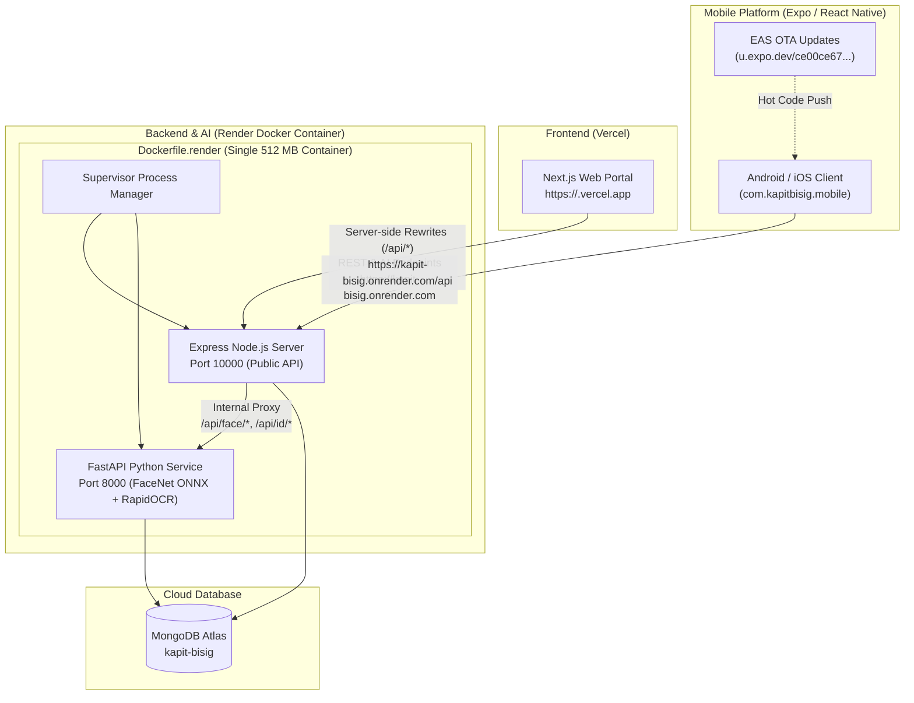

# Kapit-Bisig Full-Stack Production Deployment Guide

This guide details the complete procedure and architecture for the production deployment of the **Kapit-Bisig** ecosystem:
- **Mobile Client**: Expo EAS with Over-The-Air (OTA) Updates (`mrprinceu/kapit-bisig`)
- **Backend & AI Service**: Render.com (Unified Docker container running Express API + Python FastAPI FaceNet/RapidOCR)
- **Frontend Web App**: Vercel (Next.js with server-side API proxy rewrites)
- **Database**: MongoDB Atlas Cloud Cluster

---

## 1. System Architecture Overview



---

## 2. Database: MongoDB Atlas Setup & Seeding

1. **MongoDB Atlas Network Access**:
   - Log in to [cloud.mongodb.com](https://cloud.mongodb.com).
   - In **Network Access**, ensure `0.0.0.0/0` (Allow Access from Anywhere) is enabled since Render and Vercel use dynamic cloud IP ranges.
2. **Superadmin Verification**:
   The Superadmin account is authenticated via MongoDB (`staffusers` collection).
   To seed or migrate the Superadmin record locally:
   ```bash
   cd apps/web/apps
   npm run migrate:superadmin
   ```

---

## 3. Backend & AI Service: Render Deployment (Docker Container)

Both the Node.js Express API and the Python FastAPI AI service (FaceNet ONNX, MediaPipe, and RapidOCR) run together inside a **single unified container** defined in `Dockerfile.render` and orchestrated by `supervisord`.

- **Idle Memory**: ~330 MB
- **Peak Memory**: ~380 MB
- **Render Plan**: Free (512 MB RAM limit)

### Step 3.1: Create Render Web Service
1. Log in to [Render Dashboard](https://dashboard.render.com/).
2. Click **New +** → **Web Service**.
3. Connect your GitHub repository (`kapit-bisig`).
4. Configure service parameters:
   - **Name**: `kapit-bisig` (or `kapitbisig-api`)
   - **Region**: Singapore (`ap-southeast`) or nearest to your users
   - **Branch**: `main`
   - **Root Directory**: leave blank (repository root)
   - **Runtime**: `Docker`
   - **Dockerfile Path**: `Dockerfile.render`
   - **Instance Type**: Free (512 MB RAM)

### Step 3.2: Configure Environment Variables on Render
Under the **Environment** tab, set:

| Variable | Production Value | Purpose |
| :--- | :--- | :--- |
| `NODE_ENV` | `production` | Enables production security & optimizations |
| `PORT` | `10000` | Render default container port |
| `MONGODB_URI` | `mongodb+srv://<user>:<pass>@<cluster>.mongodb.net/kapit-bisig?...` | Atlas connection string |
| `MONGODB_REQUIRE_TLS` | `true` | Required for secure cloud connection |
| `JWT_SECRET` | *32+ character random secret* | JWT signing secret |
| `CORS_ORIGIN` | `https://<your-vercel-app>.vercel.app` | Vercel domain origin |
| `COOKIE_SECURE` | `true` | Enforces Secure cookies on HTTPS |
| `SMTP_HOST` | `smtp-relay.brevo.com` | Email delivery host |
| `SMTP_PORT` | `587` | SMTP port |
| `SMTP_SECURE` | `false` | TLS on port 587 |
| `SMTP_USER` | `<brevo-user>` | Brevo SMTP account |
| `SMTP_PASS` | `<brevo-key>` | Brevo API key |
| `SMTP_FROM` | `kapitbisig2026@gmail.com` | Verified sender email |
| `APP_NAME` | `KapitBisig` | Sender display name |
| `SMS_PROVIDER` | `unisms` | SMS provider |
| `SMS_API_KEY` | `<unisms-api-key>` | UniSMS API key |
| `SMS_SENDER_NAME` | `Unisoft` | UniSMS sender name |
| `SUPERADMIN_EMAIL` | `kapitbisig2026@gmail.com` | Primary Superadmin email identifier |

---

## 4. Frontend: Vercel Web Deployment

The web app is a Next.js application located in `apps/web/apps`.

### Step 4.1: Import Project into Vercel
1. Log in to [Vercel Dashboard](https://vercel.com/).
2. Click **Add New...** → **Project**.
3. Select your GitHub repository (`kapit-bisig`).
4. In **Project Configuration**:
   - **Framework Preset**: Next.js
   - **Root Directory**: Click *Edit* and select:
     ```
     apps/web/apps
     ```
   - **Build Command**: `next build` (or leave default)
   - **Output Directory**: `.next` (or leave default)
   - **Install Command**: `npm install`

### Step 4.2: Configure Environment Variables on Vercel
In the Vercel **Environment Variables** section:

| Variable | Value | Notes |
| :--- | :--- | :--- |
| `API_PROXY_TARGET` | `https://kapit-bisig.onrender.com/api` | Rewrites `/api/:path*` to Render backend |
| `NEXT_PUBLIC_API_URL` | `/api` | Same-origin local proxy route |

> [!IMPORTANT]
> Next.js uses server-side rewrites for `/api/*` and `/uploads/*` to the Render backend. The browser communicates with the same origin (`your-app.vercel.app`), completely eliminating third-party cookie blocking and CORS friction!

---

## 5. Mobile: Expo EAS & OTA Updates Deployment

The mobile application is managed through **Expo Application Services (EAS)**:
- **EAS Project**: `@mrprinceu/kapit-bisig`
- **Project ID**: `ce00ce67-ccf9-4868-9fff-bf67223dd80c`
- **Updates URL**: `https://u.expo.dev/ce00ce67-ccf9-4868-9fff-bf67223dd80c`

### Step 5.1: Build Standalone APK (Preview Channel)
For Android physical device testing without a development machine:
```bash
cd mobile
npx eas-cli build --profile preview --platform android
```
- EAS builds the APK in the cloud.
- Once completed, download and install the APK via the provided QR code or link.
- In `mobile/eas.json`, the preview profile automatically embeds:
  ```json
  "EXPO_PUBLIC_API_URL": "https://kapit-bisig.onrender.com/api",
  "EXPO_PUBLIC_FACE_API_URL": "https://kapit-bisig.onrender.com"
  ```

### Step 5.2: Publish Over-The-Air (OTA) Updates
Whenever you change JavaScript, React Native components, UI styling, or offline logic:

- **Preview branch (testers with Preview APK):**
  ```bash
  cd mobile
  npx eas-cli update --branch preview --message "Your update description"
  ```

- **Production branch (production users):**
  ```bash
  cd mobile
  npx eas-cli update --branch production --message "Your update description"
  ```

The mobile app's `useOTAUpdates()` hook detects the new update on startup, downloads it in the background, and prompts the user to reload the latest version without requiring an APK re-install.

### Step 5.3: Production App Bundle (AAB for Google Play)
```bash
cd mobile
npx eas-cli build --profile production --platform android
```

---

## 6. Post-Deployment Verification Checklist

### 6.1 Backend & AI Health (Render)
1. **API Health Check**:
   ```bash
   curl https://kapit-bisig.onrender.com/api/health
   ```
   Should return `{"status": "ok", "timestamp": "..."}`.
2. **AI Proxy Check**:
   ```bash
   curl -X POST https://kapit-bisig.onrender.com/api/face/detect \
     -H "Content-Type: application/json" \
     -d '{"image": ""}'
   ```
   Should return HTTP 400 validation error (confirming communication with internal Python service).

### 6.2 Frontend & Auth (Vercel)
1. Navigate to `https://<your-vercel-app>.vercel.app/login`.
2. Sign in with Superadmin credentials (`kapitbisig2026@gmail.com`).
3. Verify receipt and entry of the 6-digit email OTP.
4. Verify successful redirection to `/dashboard`.
5. Check `/users` to confirm staff list is fetched properly through Next.js proxy rewrites.

### 6.3 Mobile App (EAS & OTA)
1. Install Preview APK on an Android device connected to cellular data (4G/5G).
2. Launch app and verify connection to Render backend without network error prompts.
3. Test Resident Registration / Face Scan — confirm face detection and verification respond in ~3–5 seconds.
4. Push a minor text change via `npx eas-cli update --branch preview` and confirm that restarting the app updates the UI seamlessly.
