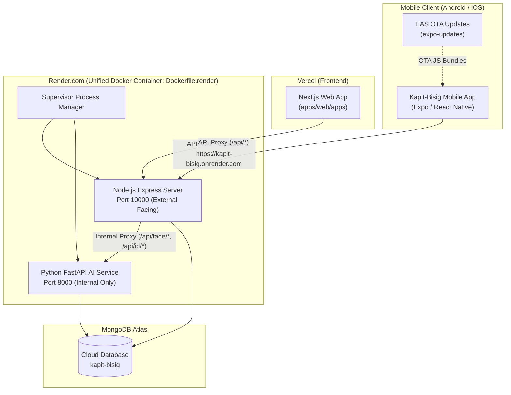

# Deployment Guide: Mobile App (EAS & OTA Updates) and AI Backend (Render Docker Container)

This guide documents the production deployment architecture for both the **Mobile App** (via Expo EAS & Over-The-Air OTA Updates) and the **Python AI Face Recognition / ID OCR Backend** (containerized on Render via Docker alongside the Node.js Express server).

---

## Architecture Overview



---

## Part 1: AI Backend & Express Server Deployment on Render (Docker Container)

### 1.1 Why a Unified Docker Container on Render?
In previous iterations, the AI backend required heavy frameworks (DeepFace, full TensorFlow) exceeding 1–2 GB RAM, which forced running separate cloud services (or Hugging Face Spaces / local Cloudflare tunnels).

We redesigned and optimized the AI engine:
1. **Lightweight FaceNet ONNX Runtime**: Replaced DeepFace/TensorFlow with a single ONNX model (`facenet512.onnx`), saving ~1.2 GB of memory while boosting inference speed.
2. **Optimized RapidOCR & Lazy Loading**: ID OCR uses single-threaded PP-OCR models with automatic downscaling via Sharp, keeping peak memory under control.
3. **Unified Supervisord Container**: Both the Node.js Express API server and the Python FastAPI AI backend run within a **single Docker container** (`Dockerfile.render`).
4. **Zero Tunnels Needed**: The Express API acts as an internal reverse proxy (`/api/face/*`, `/api/id/*`) forwarding to `http://127.0.0.1:8000`. Only one public URL (`https://kapit-bisig.onrender.com`) is exposed to mobile and web clients.
5. **Memory Footprint**: ~330 MB idle / ~380 MB peak — comfortably operating within Render's Free tier (512 MB RAM) with zero OOM crashes.

---

### 1.2 Render Service Configuration

1. Log in to [Render Dashboard](https://dashboard.render.com/).
2. Click **New +** → **Web Service**.
3. Connect your GitHub repository (`kapit-bisig`).
4. Configure the service settings:
   - **Name**: `kapit-bisig` (or `kapitbisig-api`)
   - **Region**: Singapore (`ap-southeast`) or nearest to your users
   - **Branch**: `main`
   - **Root Directory**: leave blank (repository root)
   - **Runtime**: `Docker`
   - **Dockerfile Path**: `Dockerfile.render`
   - **Instance Type**: Free (512 MB RAM)

---

### 1.3 Required Environment Variables on Render

In your Render Service Dashboard, navigate to the **Environment** tab and add:

| Variable | Value / Format | Purpose |
| :--- | :--- | :--- |
| `NODE_ENV` | `production` | Enables production security & optimizations |
| `PORT` | `10000` | Render default external port |
| `MONGODB_URI` | `mongodb+srv://<user>:<password>@<cluster>.mongodb.net/kapit-bisig?...` | MongoDB Atlas connection string |
| `MONGODB_REQUIRE_TLS` | `true` | Enforces TLS connection to MongoDB |
| `JWT_SECRET` | *32+ character random secret* | Session & token signing key |
| `CORS_ORIGIN` | `https://<your-vercel-app>.vercel.app` | Allow Vercel frontend requests |
| `COOKIE_SECURE` | `true` | Enforces Secure flag on auth cookies |
| `SMTP_HOST` | `smtp-relay.brevo.com` | Email delivery host |
| `SMTP_PORT` | `587` | SMTP port |
| `SMTP_SECURE` | `false` | TLS on port 587 |
| `SMTP_USER` | `<brevo-smtp-user>` | Brevo SMTP account |
| `SMTP_PASS` | `<brevo-smtp-key>` | Brevo API key |
| `SMTP_FROM` | `kapitbisig2026@gmail.com` | Verified sender email |
| `APP_NAME` | `KapitBisig` | Sender display name |
| `SMS_PROVIDER` | `unisms` | SMS provider identifier |
| `SMS_API_KEY` | `<unisms-api-key>` | UniSMS API key |
| `SMS_SENDER_NAME` | `Unisoft` | UniSMS sender name |
| `SUPERADMIN_EMAIL` | `kapitbisig2026@gmail.com` | Primary Superadmin email identifier |

> [!NOTE]
> `PYTHON_BACKEND_URL` defaults to `http://127.0.0.1:8000` inside the container. You do **not** need to expose port 8000 or set an external AI URL.

---

### 1.4 Verifying the Backend & AI Deployment

After Render finishes building and starts the container:

1. **Express & Health Check**:
   ```bash
   curl https://kapit-bisig.onrender.com/api/health
   ```
   Expected response:
   ```json
   {
     "status": "ok",
     "timestamp": "2026-..."
   }
   ```

2. **AI Face Recognition Proxy Check**:
   ```bash
   curl -X POST https://kapit-bisig.onrender.com/api/face/detect \
     -H "Content-Type: application/json" \
     -d '{"image": ""}'
   ```
   Expected response: HTTP 400 with `{"detail": "..."}` or `{"success": false}` (confirming the Express server successfully proxies to the Python FastAPI process inside the container).

---

## Part 2: Mobile App Deployment (Expo EAS & OTA Updates)

The mobile application is managed through **Expo Application Services (EAS)** and configured under EAS account **`mrprinceu`**:
- **Owner**: `mrprinceu`
- **Slug / Project Name**: `kapit-bisig`
- **Project ID**: `ce00ce67-ccf9-4868-9fff-bf67223dd80c`
- **Updates URL**: `https://u.expo.dev/ce00ce67-ccf9-4868-9fff-bf67223dd80c`
- **Android Package**: `com.kapitbisig.mobile`

---

### 2.1 EAS Build Profiles (`mobile/eas.json`)

The `mobile/eas.json` configuration defines build profiles:

```json
{
  "cli": {
    "version": ">= 18.4.0"
  },
  "build": {
    "development": {
      "developmentClient": true,
      "distribution": "internal",
      "channel": "development"
    },
    "preview": {
      "distribution": "internal",
      "channel": "preview",
      "android": {
        "buildType": "apk"
      },
      "env": {
        "NODE_ENV": "production",
        "EXPO_PUBLIC_ALLOW_INSECURE_HTTP": "true",
        "EXPO_PUBLIC_API_URL": "https://kapit-bisig.onrender.com/api",
        "EXPO_PUBLIC_FACE_API_URL": "https://kapit-bisig.onrender.com"
      }
    },
    "production": {
      "channel": "production",
      "android": {
        "buildType": "app-bundle"
      },
      "env": {
        "NODE_ENV": "production",
        "EXPO_PUBLIC_API_URL": "https://kapit-bisig.onrender.com/api",
        "EXPO_PUBLIC_FACE_API_URL": "https://kapit-bisig.onrender.com"
      }
    }
  }
}
```

---

### 2.2 Step 1: Building the Standalone APK (Preview Profile)

To build a standalone installable `.apk` for testing and physical device distribution:

```powershell
cd mobile

# Ensure dependencies and types pass
npm run type-check

# Trigger EAS cloud build for Android APK
npx eas-cli build --profile preview --platform android
```

1. EAS will build the `.apk` in the Expo cloud.
2. When completed, the CLI displays a direct download link and QR code to install the APK directly on Android phones.
3. Because the `preview` profile has the live Render URLs embedded, users can test immediately over mobile data or any Wi-Fi without needing a local development server.

---

### 2.3 Step 2: Publishing Over-The-Air (OTA) Updates

Over-The-Air (OTA) updates allow you to instantly publish bug fixes, screen adjustments, UI redesigns, and logic updates **without rebuilding or reinstalling the APK**, as long as native Android/iOS dependencies (like new gradle plugins) haven't changed.

#### Publishing to the Preview Channel:
```powershell
cd mobile
npx eas-cli update --branch preview --message "Fix profile modal keyboard offset and verify cooldown"
```

#### Publishing to the Production Channel:
```powershell
cd mobile
npx eas-cli update --branch production --message "Release v1.0.1 hotfix"
```

---

### 2.4 How the Mobile App Handles OTA Updates at Runtime

The mobile application includes automatic update detection configured in `app.json`:
- `runtimeVersion.policy: "appVersion"`: Guarantees updates only apply to matching app binaries.
- `updates.checkAutomatically: "ON_LOAD"`: Checks for new bundles whenever the app opens.
- `useOTAUpdates()` hook: Detects when a new bundle is downloaded in the background, displays a friendly prompt, and seamlessly reloads the new bundle.

---

### 2.5 Local Testing vs Cloud Testing (`mobile/.env`)

For local emulator or physical LAN device testing with a local backend:
```env
EXPO_PUBLIC_API_URL=http://<YOUR_LOCAL_IP>:3001/api
EXPO_PUBLIC_FACE_API_URL=http://<YOUR_LOCAL_IP>:8000
```

When building via EAS or running standalone builds, EAS injects the production URLs automatically:
```env
EXPO_PUBLIC_API_URL=https://kapit-bisig.onrender.com/api
EXPO_PUBLIC_FACE_API_URL=https://kapit-bisig.onrender.com
```

All 9 mobile service connectors (`MobileAuthService`, `VerificationAPIService`, `FaceRecognitionService`, `IDValidationService`, etc.) have their production fallback explicitly set to `https://kapit-bisig.onrender.com/api` and `https://kapit-bisig.onrender.com`, eliminating network errors if `.env` is omitted.

---

## Part 3: Verification & Health Checklist

| Component | Target / URL | Verification Action | Expected Result |
| :--- | :--- | :--- | :--- |
| **Backend API** | `https://kapit-bisig.onrender.com/api/health` | HTTP GET | `{"status": "ok"}` |
| **AI Face Proxy** | `https://kapit-bisig.onrender.com/api/face/detect` | HTTP POST (empty JSON) | HTTP 400 validation error (proves proxy to Python AI is active) |
| **ID OCR Proxy** | `https://kapit-bisig.onrender.com/api/id/verify-document` | HTTP POST (sample ID) | HTTP 200 with extracted ID fields & face bounding box |
| **Mobile Standalone APK** | Device installation | Open installed APK on 4G/5G | Connects cleanly to Render backend without network errors |
| **Mobile Face Scanner** | Resident Registration / Verification | Scan face in camera view | Detects face landmarks, performs active liveness, and registers embeddings |
| **EAS OTA Update** | Device reload after `eas update` | Publish new OTA branch update | App detects update, reloads bundle, and displays latest changes |
