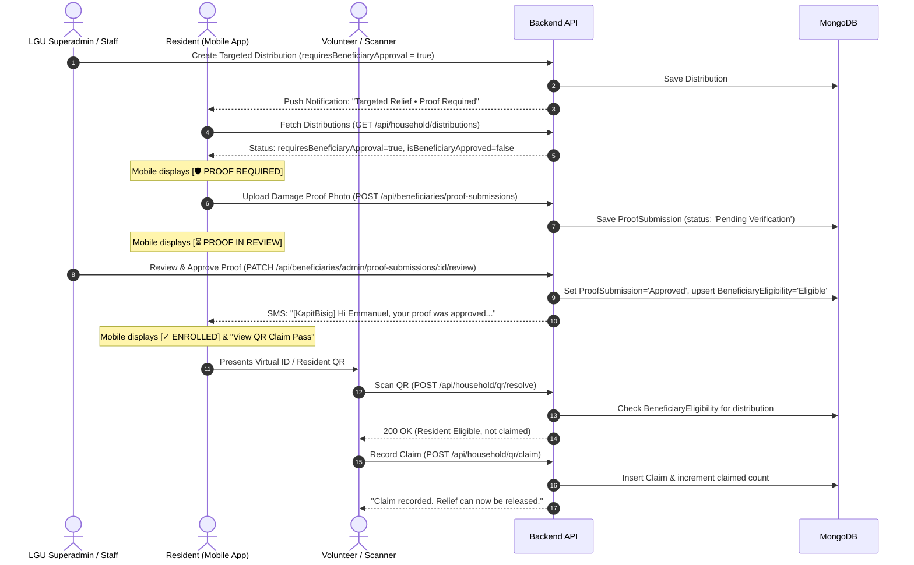

# General vs. Targeted Distribution & Proof Verification System

## 1. Overview

Kapit-Bisig relief distribution now supports two distinct distribution modes:
1. **General Distribution**: Open to all verified residents residing within the covered barangays. No proof submission or pre-assessment is required.
2. **Targeted Distribution**: Restricted strictly to pre-approved households that have submitted calamity damage assessment proof and received admin verification.

This document details the architectural decisions, database models, API contracts, mobile and web interfaces, security validations, and QR claim gating mechanisms.

---

## 2. Core Differences: General vs. Targeted

| Feature / Dimension | General Distribution | Targeted Distribution |
| :--- | :--- | :--- |
| **Eligibility Flag** | `requiresBeneficiaryApproval: false` | `requiresBeneficiaryApproval: true` |
| **Prerequisites** | Resident must be `Approved` and reside within the covered barangay(s). | Resident must be `Approved`, reside in coverage, AND have an `Approved` `BeneficiaryEligibility` record. |
| **Mobile Distribution Card Badge** | `[OPEN TO ALL]` | `[🛡️ PROOF REQUIRED]` / `[⏳ PROOF IN REVIEW]` / `[✓ ENROLLED]` |
| **Mobile Resident Action** | Immediate access to `"View QR Claim Pass"` when active. | Dynamic button: `"Submit Proof of Damage"` until approved; switches to `"View QR Claim Pass"` once approved. |
| **Push Notification** | Broadcast: *"Open to all verified residents."* (Deep-links to `distributions` screen). | Targeted broadcast: *"Damage assessment proof is required before claiming aid."* (Deep-links to `proof-request` screen). |
| **QR Scan Resolution** | Scan accepted immediately if resident is within barangay coverage. | Server verifies `BeneficiaryEligibility`. Rejects with `403 RESIDENT_NOT_ELIGIBLE` if unapproved. |

---

## 3. Architecture & Data Flow

### A. Lifecycle of a Targeted Distribution



---

## 4. Key Implementation Details

### A. QR Code Gating & Verification Safeguards

In [`apps/web/apps/server/routes/householdRoutes.ts`](file:///c:/Users/Emmanuel%20De%20Vera/Desktop/kapit-bisig/apps/web/apps/server/routes/householdRoutes.ts) and [`claimRoutes.ts`](file:///c:/Users/Emmanuel%20De%20Vera/Desktop/kapit-bisig/apps/web/apps/server/routes/claimRoutes.ts):

* **Eligibility Gate:**
  When `requiresBeneficiaryApproval` is `true`:
  ```typescript
  if (requiresBeneficiaryApproval(distribution)) {
    const isApprovedTargetBeneficiary = await isResidentApprovedBeneficiaryForDistribution(
      distributionId,
      residentId,
    );
    if (!isApprovedTargetBeneficiary) {
      return res.status(403).json({
        success: false,
        code: 'RESIDENT_NOT_ELIGIBLE',
        message: 'Resident is not an approved target beneficiary for this distribution (proof not approved).',
      });
    }
  }
  ```
* **Scanner Display:** The mobile scanner ([`VolunteerQRScannerScreen.tsx`](file:///c:/Users/Emmanuel%20De%20Vera/Desktop/kapit-bisig/mobile/components/VolunteerQRScannerScreen.tsx)) intercepts non-200 responses and renders a prominent red alert card displaying the exact rejection reason, preventing accidental release of relief supplies.

### B. Mobile Dynamic Distribution Card State

In [`mobile/components/DistributionScreen.tsx`](file:///c:/Users/Emmanuel%20De%20Vera/Desktop/kapit-bisig/mobile/components/DistributionScreen.tsx):
* **State 1: Approved Beneficiary (`isBeneficiaryApproved === true`)**
  * Displays green pill badge: `[✓ ENROLLED]`.
  * Subtitle: *"Verified Beneficiary • Enrolled"*.
  * Action button: Green `"View QR Claim Pass"`.
* **State 2: Proof Pending Review (`beneficiaryProofStatus === 'Pending Verification'`)**
  * Displays amber pill badge: `[⏳ PROOF IN REVIEW]`.
  * Warning note: *"Your damage proof is being reviewed by the LGU verifier. Claim pass will unlock once approved."*
* **State 3: Proof Required / Unapproved (`requiresBeneficiaryApproval === true`)**
  * Displays dark slate/shield pill badge: `[🛡️ PROOF REQUIRED]`.
  * Warning note: *"Photo proof of calamity damage is required before a QR claim pass can be issued."*
  * Action button: Indigo `"Submit Proof of Damage"`.
* **State 4: General Distribution (`requiresBeneficiaryApproval === false`)**
  * Displays teal pill badge: `[OPEN TO ALL]`.
  * Immediate access to `"View QR Claim Pass"`.

### C. Photo Capture & Aspect Ratio Preservation

In [`mobile/services/sync/photoWatermark.tsx`](file:///c:/Users/Emmanuel%20De%20Vera/Desktop/kapit-bisig/mobile/services/sync/photoWatermark.tsx) and [`ResidentProofRequestScreen.tsx`](file:///c:/Users/Emmanuel%20De%20Vera/Desktop/kapit-bisig/mobile/components/ResidentProofRequestScreen.tsx):
* Previously, camera photos were cropped to a strict `640x640` square (1:1), cutting off roof/structural damage context.
* **Fix Applied:** Introduced `getScaledWatermarkDimensions(origWidth, origHeight)` which computes proportionate dimensions up to `1080px` while preserving original orientation (portrait/landscape) with `resizeMode="contain"`.

### D. Full-Size Admin Proof Review Modal

In [`BeneficiaryProofReviewModal.tsx`](file:///c:/Users/Emmanuel%20De%20Vera/Desktop/kapit-bisig/apps/web/apps/src/components/beneficiaries/BeneficiaryProofReviewModal.tsx):
* Superadmins and LGU staff can inspect full-resolution damage assessment photos in an unconstrained `object-contain` viewport.
* Review actions support **Approve** or **Reject** with optional rejection reason notes.
* Approvals trigger:
  1. Status change to `Approved`.
  2. Automatic creation/update of distribution `BeneficiaryEligibility`.
  3. Real-time push / SMS notification with personalized resident greeting (`Hi {name}...`).

### E. RBAC Expansion for LGU Staff

* Previously, Resident Registration and Verified Residents management were restricted exclusively to `SUPERADMIN`.
* **Updated Permission Scope:** LGU Staff accounts can now access [`/resident-registration`](file:///c:/Users/Emmanuel%20De%20Vera/Desktop/kapit-bisig/apps/web/apps/src/app/resident-registration/page.tsx) and [`/verified-residents`](file:///c:/Users/Emmanuel%20De%20Vera/Desktop/kapit-bisig/apps/web/apps/src/app/verified-residents/page.tsx) to verify and approve resident accounts within their assigned barangays.
* Added `RESIDENT_STATUS_UPDATED` action logging in [`AuditLog.ts`](file:///c:/Users/Emmanuel%20De%20Vera/Desktop/kapit-bisig/apps/web/apps/server/models/AuditLog.ts).

---

## 5. API Endpoints Reference

### Beneficiary & Proof Verification
| Method | Endpoint | Description |
| :--- | :--- | :--- |
| `GET` | `/api/beneficiaries/distributions/open` | Lists active/open distributions accepting beneficiary proof. |
| `POST` | `/api/beneficiaries/proof-submissions` | Resident submits calamity damage photo proof for a distribution. |
| `GET` | `/api/beneficiaries/admin/proof-submissions` | Admin endpoint to filter and paginate resident proof submissions. |
| `PATCH` | `/api/beneficiaries/admin/proof-submissions/:id/review` | Admin approves or rejects submitted proof with feedback. |

### QR Scanner & Distribution Claims
| Method | Endpoint | Description |
| :--- | :--- | :--- |
| `GET` | `/api/household/distributions` | Returns resident-scoped distributions with `isBeneficiaryApproved` flag. |
| `POST` | `/api/household/qr/resolve` | Staff scans QR; performs barangay coverage & beneficiary proof gate checks. |
| `POST` | `/api/household/qr/claim` | Finalizes claim; records relief disbursement and updates pack inventory. |

---

## 6. Testing & Verification Runbook

### Scenario A: Unapproved Resident Scan on Targeted Distribution
1. Create a distribution with `requiresBeneficiaryApproval: true`.
2. Scan an unapproved resident's QR code on the staff mobile scanner.
3. **Expected:** Returns HTTP `403` (`RESIDENT_NOT_ELIGIBLE`); red rejection card is shown on scanner; claim button is blocked.

### Scenario B: Approved Resident Scan on Targeted Distribution
1. Submit damage proof for the resident and approve it in Web Admin (`/admin/proof-requests`).
2. Mobile app reflects `[✓ ENROLLED]` on the distribution card.
3. Scan resident's QR code on the staff mobile scanner.
4. **Expected:** Returns HTTP `200`; green check appears; displays *"Claim recorded. Relief can now be released."*

### Scenario C: General Distribution Scan
1. Create a distribution with `requiresBeneficiaryApproval: false`.
2. Any approved resident in the covered barangay scans their QR code.
3. **Expected:** Claim is accepted immediately without requiring proof submission.
