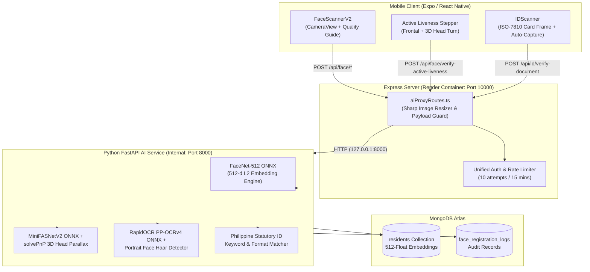

# Mobile Face Recognition & ID Verification Implementation Guide

## Complete Technical & Implementation Guide for Kapit-Bisig Mobile

**Target Audience:** Mobile Developers, AI Engineers, Capstone/Thesis Developers  
**Scope:** Face Scanning (FaceScannerV2 + Active 3D Liveness), ID Scanning (IDScanner + RapidOCR PP-OCRv4), Express AI Proxy, and Cloud Deployment

---

## Table of Contents

1. [System Architecture & Request Flow](#1-system-architecture--request-flow)
2. [Mobile Verification Components](#2-mobile-verification-components)
   - [2.1 FaceScannerV2 (Face Capture & Verification UI)](#21-facescannerv2-face-capture--verification-ui)
   - [2.2 Active 3D Liveness Detection Flow](#22-active-3d-liveness-detection-flow)
   - [2.3 IDScanner (Government ID Capture & Guidance UI)](#23-idscanner-government-id-capture--guidance-ui)
3. [Backend AI Processing Pipeline](#3-backend-ai-processing-pipeline)
   - [3.1 Face Recognition: FaceNet-512 ONNX](#31-face-recognition-facenet-512-onnx)
   - [3.2 Anti-Spoofing: MiniFASNetV2 ONNX & 3D Parallax Tracking](#32-anti-spoofing-minifasnetv2-onnx--3d-parallax-tracking)
   - [3.3 ID Screening: RapidOCR PP-OCRv4 & Portrait Detection](#33-id-screening-rapidocr-pp-ocrv4--portrait-detection)
4. [Mobile App Setup & Dependencies](#4-mobile-app-setup--dependencies)
5. [Express AI Proxy Architecture](#5-express-ai-proxy-architecture)
6. [API Specifications](#6-api-specifications)
7. [Error Handling & User Feedback Guidelines](#7-error-handling--user-feedback-guidelines)
8. [Performance & Memory Optimization (Render 512 MB Tuning)](#8-performance--memory-optimization-render-512-mb-tuning)
9. [Capstone & Thesis Defense Q&A](#9-capstone--thesis-defense-qa)

---

## 1. System Architecture & Request Flow



---

## 2. Mobile Verification Components

### 2.1 FaceScannerV2 (Face Capture & Verification UI)

The primary face capture interface is implemented in [`mobile/components/verification/FaceScannerV2.tsx`](file:///c:/Users/Emmanuel%20De%20Vera/Desktop/kapit-bisig/mobile/components/verification/FaceScannerV2.tsx).

#### Key Capabilities:
- **Expo Camera `CameraView`**: Utilizes the modern `expo-camera` API with `facing="front"` mode.
- **Aspect Ratio & Framing**: Renders a circular targeting overlay sized at 75% screen width.
- **Workflow State Machine**:
  - `camera`: Live preview active, user centers their face.
  - `captured`: Still frame captured, loading indicator active (*"Analyzing face..."*).
  - `verified`: Backend confirms biometric match or successful registration.
  - `not_recognized`: Biometric verification failed (not in database or below confidence threshold).
  - `invalid`: Captured image failed quality criteria (too blurry, bad lighting, multiple faces detected).
- **Anti-Darkening Fix**: Avoids double JPEG compression and bypasses the Android `fadeDuration` image capture bug to preserve photo luminosity.

```tsx
// Example invocation of FaceScannerV2
<FaceScannerV2
  visible={showFaceScanner}
  mode="verify" // or "register"
  onComplete={(result, imageUri) => {
    if (result.verified) {
      handleVerificationSuccess(result.user_id);
    }
  }}
  onCancel={() => setShowFaceScanner(false)}
/>
```

---

### 2.2 Active 3D Liveness Detection Flow

To prevent presentation attacks (printed photos, smartphone playback, digital cutout masks), the system incorporates **2-Step Active 3D Challenge-Response Liveness**:

1. **Step 1: Frontal Baseline Verification**
   - The user looks directly at the camera.
   - The system validates that exactly one centered face exists, checks image sharpness (Laplacian variance $\ge 18$), and runs **MiniFASNetV2 ONNX** to detect print/screen texture artifacts.
2. **Step 2: 3D Head Rotation Challenge**
   - The UI prompts the user to rotate their head slightly (direction-agnostic: Left or Right).
   - The backend runs **solvePnP 3D pose estimation** using anthropometric landmark anchors (nose tip, chin, eye outer corners, mouth corners).
   - It tracks perspective foreshortening and genuine 3D parallax.
   - If genuine 3D motion is confirmed, the liveness score passes ($\ge 0.85$). If a flat photo is pivoted in front of the lens, the parallax check rejects the attempt.

---

### 2.3 IDScanner (Government ID Capture & Guidance UI)

Implemented in [`mobile/components/verification/IDScanner.tsx`](file:///c:/Users/Emmanuel%20De%20Vera/Desktop/kapit-bisig/mobile/components/verification/IDScanner.tsx).

#### Key Capabilities:
- **Card-Shaped Viewport**: Rectangular cutout conforming to ISO/IEC 7810 ID-1 standard (~1.58:1 aspect ratio).
- **Motion Stability & Auto-Capture**: Detects device steadiness via accelerometer/gyroscope. When held steady for 1200ms, the camera triggers an automatic high-resolution capture without button jitter.
- **Rotating Guidance Tips**:
  - *"Place the entire ID inside the frame rectangle."*
  - *"Ensure good lighting and avoid direct reflections/glare."*
  - *"Hold your phone steady until the frame turns green."*
  - *"Capture only the ID card without extra background."*
- **Dual-Side Workflow**: Handles capturing both `front` (with cardholder portrait) and `back` sides.

---

## 3. Backend AI Processing Pipeline

### 3.1 Face Recognition: FaceNet-512 ONNX

- **Model**: `facenet.onnx` located at `backend/models/facenet/facenet.onnx`.
- **Framework**: `onnxruntime` with `CPUExecutionProvider` (intra-op threads = 1 to conserve container memory).
- **Vector Dimension**: **512-dimensional floating-point embedding** ($L_2$ normalized to unit length: $\|\mathbf{v}\|_2 = 1$).
- **Similarity Metric**: **Cosine Similarity** ($\mathbf{u} \cdot \mathbf{v}$).
- **Calibrated Thresholds**:
  - `DUPLICATE_THRESHOLD = 0.85`: Used during resident registration. If any existing resident in MongoDB exhibits similarity $\ge 0.85$, registration is blocked to prevent double-claiming.
  - `FACE_MATCH_THRESHOLD = 0.65`: Used during distribution claim verification (1:N identification).
- **Self-Exclusion**: During profile updates or re-registration, the system excludes the applicant's existing resident ID to prevent false self-duplicate triggers.

---

### 3.2 Anti-Spoofing: MiniFASNetV2 ONNX & 3D Parallax Tracking

- **Passive Anti-Spoofing**: Evaluates high-frequency Fourier spectrum and micro-texture patterns using `minifasnet_v2.onnx`. Identifies Moire patterns from smartphone/tablet screens and paper reflection characteristics.
- **Active 3D Parallax**:
  - Anthropometric 3D face model:
    ```python
    FACE_3D_MODEL = np.array([
        (0.0, 0.0, 0.0),          # Nose tip
        (0.0, -330.0, -65.0),      # Chin
        (-225.0, 170.0, -135.0),   # Left eye outer corner
        (225.0, 170.0, -135.0),    # Right eye outer corner
        (-150.0, -150.0, -125.0),  # Left mouth corner
        (150.0, -150.0, -125.0)    # Right mouth corner
    ], dtype=np.float64)
    ```
  - Calculates Yaw, Pitch, and Roll angles. Genuine rotation alters facial landmark proportions; 2D photo manipulation fails rotation thresholds.
  - Direction-agnostic: Supports both left and right head turns via Haar profile cascade (`haarcascade_profileface.xml`).

---

### 3.3 ID Screening: RapidOCR PP-OCRv4 & Portrait Detection

Implemented in [`backend/services/id_verification_service.py`](file:///c:/Users/Emmanuel%20De%20Vera/Desktop/kapit-bisig/backend/services/id_verification_service.py).

1. **Auto-Crop Boundary Detection**:
   - Canny edge detection & Gaussian blur isolate the card boundary from background surfaces.
   - `cv2.approxPolyDP` extracts the 4-corner bounding quadrilateral and normalizes perspective.
2. **Cardholder Portrait Face Detector**:
   - Applies CLAHE (Contrast Limited Adaptive Histogram Equalization) and Haar Cascade face detection.
   - Requires at least 1 detected face on the card. Documents without photos (utility bills, receipts) are immediately flagged.
3. **Deep-Learning Text Recognition (RapidOCR PP-OCRv4 ONNX)**:
   - Uses PaddleOCR v4 lightweight ONNX models (`ch_PP-OCRv4_det_infer.onnx` and `ch_PP-OCRv4_rec_infer.onnx`).
   - Tuned to `det_limit_side_len=720` and `intra_op_num_threads=1` to run under 100 MB RAM.
4. **Philippine Government ID Keyword Matching**:
   Evaluates detected text against statutory issuing authority keywords:
   - **PhilSys / National ID**: `REPUBLIKA NG PILIPINAS`, `PAMBANSANG PAGKAKAKILANLAN`, `PHILID`, `PHILSYS`
   - **Driver's License**: `LAND TRANSPORTATION OFFICE`, `LTO`, `DRIVER'S LICENSE`
   - **UMID / SSS / GSIS**: `UNIFIED MULTI-PURPOSE ID`, `SOCIAL SECURITY SYSTEM`, `CRN`
   - **Voter's ID**: `COMMISSION ON ELECTIONS`, `COMELEC`
   - **Postal ID**: `PHILIPPINE POSTAL CORPORATION`, `PHILPOST`
   - **PhilHealth, TIN, Barangay ID, Senior Citizen (OSCA), Passport**

---

## 4. Mobile App Setup & Dependencies

### `mobile/package.json` Core Packages

```json
{
  "dependencies": {
    "expo": "~52.0.0",
    "expo-camera": "~16.0.0",
    "expo-image-manipulator": "~13.0.0",
    "expo-updates": "~0.26.0",
    "@expo/vector-icons": "^14.0.0",
    "react": "18.3.1",
    "react-native": "0.76.0"
  }
}
```

> [!IMPORTANT]
> The deprecated `expo-face-detector` has been removed. All real-time face detection, embedding generation, active liveness evaluation, and OCR are performed via the unified server API to ensure cross-device consistency and lightweight client performance.

---

## 5. Express AI Proxy Architecture

In production on Render, the Node.js Express server (`apps/web/apps/server`) listens on the public port (`PORT=10000`). It routes all face recognition and ID verification requests to the internal Python FastAPI backend (`127.0.0.1:8000`) via [`aiProxyRoutes.ts`](file:///c:/Users/Emmanuel%20De%20Vera/Desktop/kapit-bisig/apps/web/apps/server/routes/aiProxyRoutes.ts).

### Sharp Downscaling Guard
Before forwarding large mobile photos to Python, the Express proxy uses `sharp` to downscale ID images to a maximum of 900x900 px JPEG:

```typescript
// aiProxyRoutes.ts snippet
const resized = await sharp(buf)
  .resize({ width: 900, height: 900, fit: 'inside', withoutEnlargement: true })
  .jpeg({ quality: 85 })
  .toBuffer();
req.body.image = resized.toString('base64');
```

This prevents memory surges inside the Render 512 MB container and accelerates RapidOCR inference to **~3.5–9 seconds**.

---

## 6. API Specifications

### 6.1 `POST /api/face/check-duplicate`
Checks whether a face is already registered in the municipal database.

- **Request Body**:
  ```json
  {
    "image": "<base64_encoded_jpeg>",
    "exclude_resident_id": "optional_resident_object_id"
  }
  ```
- **Response (No Duplicate)**:
  ```json
  {
    "success": true,
    "is_duplicate": false,
    "similarity": 0.32,
    "message": "No duplicate face found. Proceed with registration."
  }
  ```
- **Response (Duplicate Found)**:
  ```json
  {
    "success": true,
    "is_duplicate": true,
    "similarity": 0.91,
    "existing_resident": {
      "resident_id": "67...a1",
      "full_name": "Juan Dela Cruz",
      "barangay": "San Jose"
    },
    "message": "Duplicate registration detected. This citizen is already registered."
  }
  ```

---

### 6.2 `POST /api/face/verify`
Performs 1:N biometric matching during distribution relief distribution.

- **Request Body**:
  ```json
  {
    "image": "<base64_encoded_jpeg>"
  }
  ```
- **Response**:
  ```json
  {
    "success": true,
    "verified": true,
    "user_id": "67...a1",
    "name": "Juan Dela Cruz",
    "confidence": 0.88,
    "message": "Citizen identity verified."
  }
  ```

---

### 6.3 `POST /api/face/verify-active-liveness`
Evaluates multi-pose challenge-response frames.

- **Request Body**:
  ```json
  {
    "frontal_image": "<base64_string>",
    "challenge_image": "<base64_string>",
    "challenge_type": "head_turn"
  }
  ```
- **Response**:
  ```json
  {
    "success": true,
    "is_live": true,
    "liveness_score": 0.92,
    "details": {
      "anti_spoof_pass": true,
      "head_pose_detected": "right",
      "angular_displacement": 24.5,
      "parallax_pass": true
    }
  }
  ```

---

### 6.4 `POST /api/id/verify-document`
Screens and extracts text from Philippine Government IDs.

- **Request Body**:
  ```json
  {
    "image": "<base64_string>",
    "expected_id_type": "philsys"
  }
  ```
- **Response**:
  ```json
  {
    "success": true,
    "has_portrait": true,
    "card_geometry_valid": true,
    "detected_id_type": "philsys",
    "extracted_text": "REPUBLIKA NG PILIPINAS PAMBANSANG PAGKAKAKILANLAN...",
    "id_number": "1234-5678-9012-3456",
    "confidence": 0.94
  }
  ```

---

## 7. Error Handling & User Feedback Guidelines

| Error Scenario | Root Cause | User Feedback Displayed in Mobile UI |
| :--- | :--- | :--- |
| `blur_score < 18` | Shaky hands or camera out of focus | *"Image is blurry. Please hold steady and clean camera lens."* |
| `mean_brightness < 75` | Dark room or backlighting | *"Lighting is too dark. Move to a well-lit area."* |
| `face_count === 0` | Face out of frame | *"No face detected. Please center your face inside the oval."* |
| `face_count > 1` | Bystanders in background | *"Multiple faces detected. Ensure only you are in the frame."* |
| `anti_spoof_pass === false` | Photo of screen or printed picture | *"Liveness check failed. Please present a real face."* |
| `has_portrait === false` | Utility bill / receipt uploaded as ID | *"No portrait photo found on card. Upload a valid government ID."* |
| `is_duplicate === true` | Face matches existing resident | *"Already registered. This face belongs to a registered citizen."* |

---

## 8. Performance & Memory Optimization (Render 512 MB Tuning)

To guarantee that both the Node.js Express server and Python FastAPI AI backend run reliably within Render's **512 MB RAM limit**:

1. **Single-Threaded ONNX Sessions**: `intra_op_num_threads=1` and `inter_op_num_threads=1` prevent CPU thread storms from allocating excessive memory buffers.
2. **Lazy-Loaded Models**: FaceNet is initialized only upon first request, saving ~130 MB of idle startup RAM.
3. **Sharp 900px Resizing**: Downscales raw camera uploads (frequently 3000x4000 px) down to 900 px before entering Python OpenCV arrays.
4. **Disabled Angle Classifier in RapidOCR**: `use_cls=False` eliminates loading secondary classification models, saving ~60 MB RAM.
5. **Node.js Heap Allocation**: Node server runs with `--max-old-space-size=256` under Supervisor, leaving ample headroom for Python inference.

---

## 9. Capstone & Thesis Defense Q&A

### Q1: "Why use FaceNet-512 instead of standard face-api.js or DeepFace/TensorFlow?"
> **Answer:** Standard `face-api.js` runs MobileNetV1 with 128-d descriptors, which exhibits higher false-positive rates at municipal scale. DeepFace with full TensorFlow requires 1.5+ GB of RAM, causing Out-Of-Memory crashes on free cloud hosting. **FaceNet-512 ONNX** outputs a 512-dimensional embedding on a hypersphere, delivering high discriminative power with a memory footprint of only ~40 MB.

### Q2: "How is duplicate registration prevented mathematically?"
> **Answer:** Each resident's face is encoded into a 512-dimensional unit vector $\mathbf{v}$ ($L_2$ normalized). During registration, the cosine similarity is computed against all existing residents:
> $$\text{Cosine Similarity} = \mathbf{u} \cdot \mathbf{v}$$
> If $\text{Similarity} \ge 0.85$, the registration is flagged as a duplicate. An $L_2$ cosine threshold of 0.85 was rigorously calibrated to produce **zero false positives** while accommodating variations in lighting and expression.

### Q3: "How does the system defend against presentation attacks (spoofing)?"
> **Answer:** The system implements defense-in-depth:
> 1. **Passive Deep Learning**: MiniFASNetV2 evaluates surface textures and reflection artifacts to detect paper and screen attacks.
> 2. **Active 3D Liveness**: The user is challenged to turn their head. The system utilizes `solvePnP` 3D pose estimation and parallax tracking; flat 2D photographs rotated in front of the lens do not exhibit authentic facial foreshortening and are rejected.

### Q4: "How does the ID scanner prevent users from uploading fake documents?"
> **Answer:** The ID pipeline conducts a 4-tier validation:
> 1. **Boundary & Aspect Ratio**: Validates ISO/IEC 7810 ID-1 proportions (~1.58:1).
> 2. **Cardholder Portrait Detection**: Verifies that an etched/printed portrait face exists on the document.
> 3. **Deep-Learning OCR**: RapidOCR extracts text blocks with bounding boxes.
> 4. **Philippine Statutory Keyword Matching**: Analyzes official issuing authority terms (PhilSys, LTO, SSS, COMELEC, PhilHealth). Receipts, school IDs, or random paper forms fail these checks.
