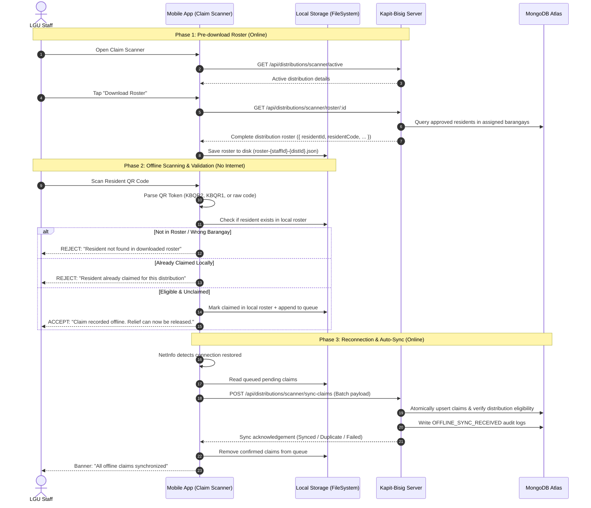

# Staff Offline Scanner Mode & Claim Synchronization

## 1. Overview & Objective

During disaster relief operations or in remote barangays, internet connectivity is frequently degraded, intermittent, or completely unavailable. Staff and volunteers distributing relief goods need to verify resident eligibility and confirm relief release without depending on a continuous internet connection.

The **Staff Offline Scanner Mode** allows LGU staff members to:
1. **Pre-download Distribution Rosters** on their mobile device while connected to internet or Wi-Fi.
2. **Scan and Validate Resident QR Codes Offline** using cryptographic token parsing and local roster verification.
3. **Prevent Immediate Duplicates** locally across repeated scans.
4. **Queue Recorded Claims Locally** in persistent sandboxed device storage.
5. **Automatically Synchronize** queued claims to the server once internet connectivity is restored.

---

## 2. System Architecture & Lifecycle



---

## 3. Core Components

### 3.1. Mobile Client-Side QR Token Parser
**File:** [`mobile/services/sync/QrTokenParser.ts`](file:///c:/Users/Emmanuel%20De%20Vera/Desktop/kapit-bisig/mobile/services/sync/QrTokenParser.ts)

Extracts the `residentCode` and metadata directly on the device without requiring server verification.

* **Supported Formats:**
  1. `KBQR2.<payload>.<signature>`: Signed base64url JSON token. The parser extracts `rid` (resident code) and `qv` (QR version). Signature verification is intentionally preserved for the server during online resolution, as signing secrets must not be stored on client mobile devices.
  2. `KBQR1.<payload>`: Unsigned base64url JSON token (legacy format).
  3. `XX-YYYY-NNNNNN`: Raw resident alphanumeric code regex fallback.
* **Corrupted / Invalid Protection:** Returns `null` if any malformed or tampered strings are provided.

---

### 3.2. Offline Storage Manager
**File:** [`mobile/services/sync/ScannerOfflineStore.ts`](file:///c:/Users/Emmanuel%20De%20Vera/Desktop/kapit-bisig/mobile/services/sync/ScannerOfflineStore.ts)

Manages sandboxed file persistence in `expo-file-system`. Each staff user has their own isolated directory:
`{documentDirectory}/scanner_offline/{staffId}/`

* **Stored Files:**
  * `roster-{distributionId}.json`: Contains the target barangay resident list, already-claimed flags, and download metadata.
  * `claims-{distributionId}.json`: FIFO queue of offline claims awaiting sync.
* **Key Functions:**
  * `saveDistributionRoster(staffId, rosterData)`: Saves the downloaded roster.
  * `loadDistributionRoster(staffId, distributionId)`: Reads the cached roster.
  * `isResidentClaimedLocally(staffId, distributionId, residentId)`: Checks both the local roster and the pending queue to prevent duplicate disbursements.
  * `addOfflineClaim(staffId, distributionId, claim)`: Appends an offline claim to the pending queue and marks the local roster entry as claimed.
  * `removeOfflineClaims(staffId, distributionId, clientGeneratedIds)`: Purges synced claims once verified by the server.

---

### 3.3. Claim Synchronization Coordinator
**File:** [`mobile/services/sync/ClaimSyncCoordinator.ts`](file:///c:/Users/Emmanuel%20De%20Vera/Desktop/kapit-bisig/mobile/services/sync/ClaimSyncCoordinator.ts)

* **Network Monitoring:** Attaches a listener via `@react-native-community/netinfo` to monitor device connectivity.
* **Auto-Sync:** When transitioning from offline to online, initiates `syncPendingClaims()` automatically with a debounce lock.
* **Manual Sync:** Exposes `syncPendingClaims()` to UI components for manual trigger.
* **Batch Processing:** Posts batches of claims (up to 500 per payload) to the server.
* **Event Subscriptions:** Components subscribe to snapshot changes (`online`, `pendingCount`, `isSyncing`, `lastSyncedAt`).

---

### 3.4. Volunteer Scanner Screen
**File:** [`mobile/components/VolunteerQRScannerScreen.tsx`](file:///c:/Users/Emmanuel%20De%20Vera/Desktop/kapit-bisig/mobile/components/VolunteerQRScannerScreen.tsx)

* **Offline Status Banner:** Displays an orange banner when offline indicating local roster status (`"Scanning offline using local roster (N residents)"`).
* **Download Roster Button:** Allows staff to explicitly pull or update the local roster while online.
* **Instant Offline Release Confirmation:** When a scan succeeds offline, plays haptic feedback and displays a green release approval message:
  > *"Claim recorded offline. Relief can now be released. (Will sync when reconnected)"*
* **Duplicate Protection:** Rejects scans immediately if the resident is already marked claimed locally.
* **Reconnection Sync Notice:** Displays sync progress and pending queue counts.
* **Interactive Assignment Recovery:** Tapping the reload icon or notice allows re-fetching active assignments on demand.

---

## 4. Backend Endpoints

### 4.1. Download Distribution Roster
* **Endpoint:** `GET /api/distributions/scanner/roster/:distributionId`
* **Access Control:** `LGU_STAFF` only. The distribution must be within the staff member's assigned barangay scope.
* **Response Payload:**
  ```json
  {
    "success": true,
    "data": {
      "distributionId": "6aba415f56f91acd14e8f3e2",
      "distributionName": "Poblacion Relief Drive",
      "barangays": ["Poblacion"],
      "downloadedAt": "2026-09-28T10:00:00.000Z",
      "totalCount": 11,
      "claimedCount": 0,
      "roster": [
        {
          "residentId": "6ab94f3684ef18613720a639",
          "residentCode": "PO-2026-000005",
          "maskedName": "Emmanuel D.",
          "barangay": "Poblacion",
          "householdNumber": "HH-1234",
          "alreadyClaimed": false,
          "claimedAt": null
        }
      ]
    }
  }
  ```

### 4.2. Synchronize Offline Claims Batch
* **Endpoint:** `POST /api/distributions/scanner/sync-claims`
* **Access Control:** `LGU_STAFF` only.
* **Request Validation Schema (`syncClaimsBody`):**
  * `deviceId`: UUID string identifying the scanning phone.
  * `distributionId`: Valid Mongo ObjectId.
  * `claims`: Array of 1 to 500 items, each containing:
    * `clientGeneratedId`: Unique UUID generated by the mobile client.
    * `residentId`: Mongo ObjectId of the resident.
    * `residentCode`: Resident alphanumeric code.
    * `scannedAt`: ISO8601 string recorded at the time of the scan.
* **Idempotency & Deduplication:**
  Uses MongoDB atomic `$setOnInsert` on `{ householdId, distributionId, claimCategory: 'DISTRIBUTION' }`. If another staff member synced the same resident earlier, the server marks the result as `Duplicate` and avoids double allocations.
* **Audit Trail:**
  Writes an `OFFLINE_SYNC_RECEIVED` audit entry and registers the device ID, client generated ID, and exact offline scan timestamp.

---

## 5. Security & Data Protection Considerations

1. **No Cryptographic Secrets on Client Devices:** The HMAC secret used to sign resident QR tokens is never bundled into the mobile app. The client checks eligibility against the authenticated roster downloaded directly from the server.
2. **Barangay Scope Enforcement:** Staff can only download rosters and sync claims for distributions covering barangays they are assigned to.
3. **Device Storage Sandboxing:** Roster and claims files are stored in app-private directory space (`FileSystem.documentDirectory`), preventing access by third-party apps on the phone.
4. **Logout Safeguards:** If a staff member attempts to log out with un-synced claims, a confirmation alert warns them to reconnect to avoid data loss.

---

## 6. Verification & Test Scenarios

| Scenario | Steps | Expected Outcome |
| :--- | :--- | :--- |
| **Online Roster Download** | Connect phone to Wi-Fi &rarr; Open Scanner &rarr; Tap "Download Roster" | Roster downloaded; UI confirms total resident count. |
| **Offline Valid Resident Scan** | Turn on Airplane Mode &rarr; Scan approved resident QR | Green confirmation: relief can be released; claim queued locally. |
| **Offline Duplicate Scan** | Scan the same resident QR a second time while still offline | Rejection: *"Resident already claimed for this distribution."* |
| **Offline Wrong Barangay Scan** | Scan a resident QR from a different barangay | Rejection: *"Resident not found in downloaded distribution roster for offline release."* |
| **Reconnection Auto-Sync** | Turn off Airplane Mode (reconnect to internet) | Coordinator detects connectivity, uploads queued batch, purges local queue. |
