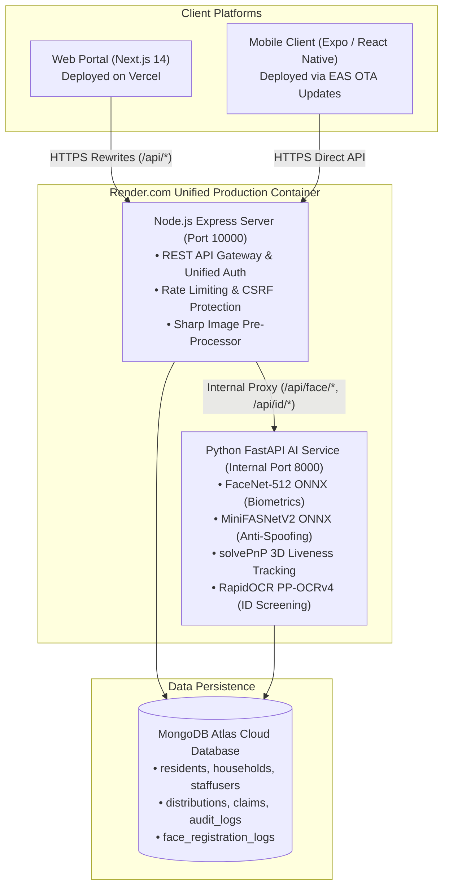

# Kapit-Bisig: Master System Documentation

## Municipal Social Welfare & Disaster Relief Distribution Platform with Biometric Fraud Prevention

---

## Executive Summary

**Kapit-Bisig** ("Holding Hands" / "Bayanihan Solidarity") is a full-stack municipal disaster relief and social welfare assistance management system. It is designed to resolve the critical challenges faced by Philippine Local Government Units (LGUs) and emergency responders during relief operations:

1. **Elimination of Duplicate Claims**: Enforcing biometric uniqueness using **FaceNet-512 ONNX** to guarantee each citizen is registered once across barangays.
2. **Automated Document Screening**: Validating statutory Philippine Government IDs and extracting citizen data via **RapidOCR (PP-OCRv4 ONNX)** and facial portrait verification.
3. **Targeted vs. General Distributions**: Supporting both universal disaster relief (per-household relief packs) and vulnerable-sector assistance (4Ps, PWD, Senior Citizens, Solo Parents) with pre-assessment intake.
4. **Resilient Field Verification**: Supporting high-speed QR claiming, facial liveness verification, and an **Offline Field Scanner Mode** that synchronizes claims when connectivity returns.
5. **Transparency & Auditability**: Comprehensive audit logging, role-based access control, OTP-verified account recovery, and real-time inventory and distribution metrics.

---

## 1. System Architecture



---

## 2. User Roles & Permission Hierarchy

| Role | Access Scope & Responsibilities | Interface |
| :--- | :--- | :--- |
| **Superadmin** | Full municipal oversight, system configuration, staff creation, distribution cycle history, audit log inspection, and system-wide analytics. Authenticated with email OTP. | Web Portal (`/dashboard`, `/users`, `/settings`) |
| **LGU Staff** | Household profiling, resident intake approval, distribution creation, beneficiary assignment, and inventory monitoring. Restricted to assigned barangays. | Web Portal (`/households`, `/distributions`, `/reports`) |
| **Volunteer / Field Distributor** | Relief distribution scanning, QR code validation, offline biometric verification, and claim dispatching in field distribution centers. | Mobile App (Volunteer / Staff Mode) |
| **Resident / Citizen** | Mobile profile management, digital Household QR ID, distribution schedule notifications, assistance claim history, and password/PIN recovery. | Mobile App (Resident Mode) |

---

## 3. Core Functional Modules

### 3.1 Resident Intake & Biometric Deduplication
- **Digital Registration**: Captures demographic details, household relationships, contact info, and government ID scans.
- **Biometric Face Encoding**: Generates a 512-dimensional $L_2$-normalized vector using **FaceNet-512 ONNX**.
- **Hyperspherical Duplicate Check**: Evaluates cosine similarity against all registered residents in the municipality. If similarity $\ge 0.85$, registration is blocked with a duplicate conflict warning.
- **Anti-Spoofing & Active Liveness**: Requires 2-step challenge-response (frontal capture + 3D head rotation pose estimation via `solvePnP` and **MiniFASNetV2**) to reject paper prints and screen replays.

### 3.2 Automated Government ID Screening (RapidOCR)
- **Geometry & Boundary Detection**: Isolates ID cards using Canny edge detection and validates ISO/IEC 7810 ID-1 aspect ratios (~1.58:1).
- **Cardholder Portrait Verification**: Uses OpenCV Haar Cascades to verify that the uploaded document contains an authentic cardholder photo.
- **Deep-Learning Character Extraction**: RapidOCR (PP-OCRv4 ONNX) extracts text blocks, identifies statutory Philippine issuing authorities (PhilSys, LTO, UMID, COMELEC, PhilHealth, etc.), and cross-verifies ID numbers and applicant names.

### 3.3 Relief Distribution Lifecycle
```
[ Planned ] ──► [ Open / Active ] ──► [ Completed (100% Claimed) ] ──► [ Archived ]
                       │
                       └──► [ Rescheduled / Paused ]
```
- **General Distributions**: Open to all active, verified households in designated barangays.
- **Targeted Distributions**: Filtered by specific socio-economic vulnerability criteria (e.g., 4Ps, indigent, senior citizens, disaster evacuation zones) with pre-assessment intake.
- **Proof QR Gating**: Encrypted QR tokens generated per household and distribution cycle to prevent forged claims.

### 3.4 Staff Offline Scanner Mode
- Enables relief distribution in disaster evacuation centers where cellular data and internet are cut off.
- Pre-downloads encrypted beneficiary rosters and cryptographic claim verification keys.
- Records claims locally on physical Android devices and automatically synchronizes queued claims upon reconnecting to the cloud.

### 3.5 Security, Hardening & Compliance
- **Philippine Data Privacy Act (R.A. 10173)**: Raw facial images are processed in transient memory and discarded. Only irreversible 512-float mathematical embeddings are persisted.
- **NoSQL Injection & Parameter Sanitization**: Custom MongoDB sanitizer strips `$` and `.` operators.
- **Double-Submit CSRF Protection & Rate Limiting**: Dedicated rate limiters on auth, face capture, and general endpoints.

---

## 4. Technology Stack & Production Topology

| Tier | Component | Production Platform | Key Technologies |
| :--- | :--- | :--- | :--- |
| **Frontend Web** | Municipal Admin & Staff Portal | **Vercel** | Next.js 14, React, Tailwind CSS, Lucide Icons |
| **Backend API** | Express Gateway | **Render.com (Docker)** | Node.js 20, TypeScript, Express, Sharp, Mongoose |
| **AI Backend** | Biometrics & OCR Service | **Render.com (Docker)** | Python 3.10, FastAPI, ONNX Runtime, OpenCV, RapidOCR |
| **Mobile App** | Citizen & Volunteer Client | **Expo EAS (OTA Updates)** | React Native, Expo 52, CameraView, TypeScript |
| **Database** | Primary Datastore | **MongoDB Atlas** | MongoDB 7.0 (M10+ Replica Set), TLS 1.3 |

---

## 5. Master Documentation Index & Reading Guide

For detailed technical references, refer to the specialized documentation files:

```text
docs/
├── SYSTEM_DOCUMENTATION.md                   # 📍 YOU ARE HERE (Master Architecture & Overview)
├── DOCS_INDEX.md                             # Documentation Index & Quick Links
│
├── Deployment & Production:
│   ├── DEPLOYMENT_GUIDE.md                   # Full-Stack Master Deployment (Vercel, Render, EAS)
│   ├── DEPLOYMENT_GUIDE_MOBILE_AND_AI.md     # Mobile EAS OTA & Render Docker Container Guide
│   └── ID_VERIFICATION_AND_MOBILE_OTA_STABILIZATION.md # Render 512MB RAM & Mobile Network Tuning
│
├── Biometrics & Verification:
│   ├── FACE_RECOGNITION_SYSTEM_DOCUMENTATION.md # FaceNet-512 ONNX, Cosine Math, Defense Q&A
│   ├── ID_SCAN_SYSTEM_DOCUMENTATION.md       # RapidOCR PP-OCRv4, Portrait Face Check, ID-1 Spec
│   ├── MOBILE_FACE_RECOGNITION_IMPLEMENTATION_GUIDE.md # Mobile UI, CameraView, Step Guides
│   └── ID_AND_FACE_VERIFICATION_CHANGES.md   # Architectural Upgrades & Performance Benchmarks
│
├── System Features & Operations:
│   ├── GENERAL_VS_TARGETED_DISTRIBUTION_SYSTEM.md # Relief Aid Targeting & Beneficiary Gating
│   ├── STAFF_OFFLINE_SCANNER_IMPLEMENTATION.md    # Field Offline Queue & Claim Synchronization
│   ├── TARGET_BENEFICIARY_IMPLEMENTATION.md       # Pre-Assessment Intake & Aid Categories
│   ├── DATABASE_SCHEMA.md                    # MongoDB Collections & Schema Specifications
│   ├── API_DOCUMENTATION.md                  # REST API Route Reference
│   ├── SECURITY_CHECKLIST.md                 # Security Hardening & Audit Checklist
│   └── MAINTENANCE_NOTES.md                  # Operational Procedures & Secret Management
```

---

## 6. Verification & Quickstart

To run the full stack locally for development:

```powershell
# 1. Install all dependencies across monorepo workspaces
npm run install:all

# 2. Start all services concurrently (Web: 3000, Server: 3001, Python AI: 8000, Mobile: Expo)
npm run dev
```

For live production health checks:
- **Backend API**: `https://kapit-bisig.onrender.com/api/health`
- **AI Proxy Verification**: `POST https://kapit-bisig.onrender.com/api/face/detect`
- **Frontend Web Portal**: `https://<your-vercel-domain>.vercel.app`
- **Mobile EAS Channel**: `https://u.expo.dev/ce00ce67-ccf9-4868-9fff-bf67223dd80c`
